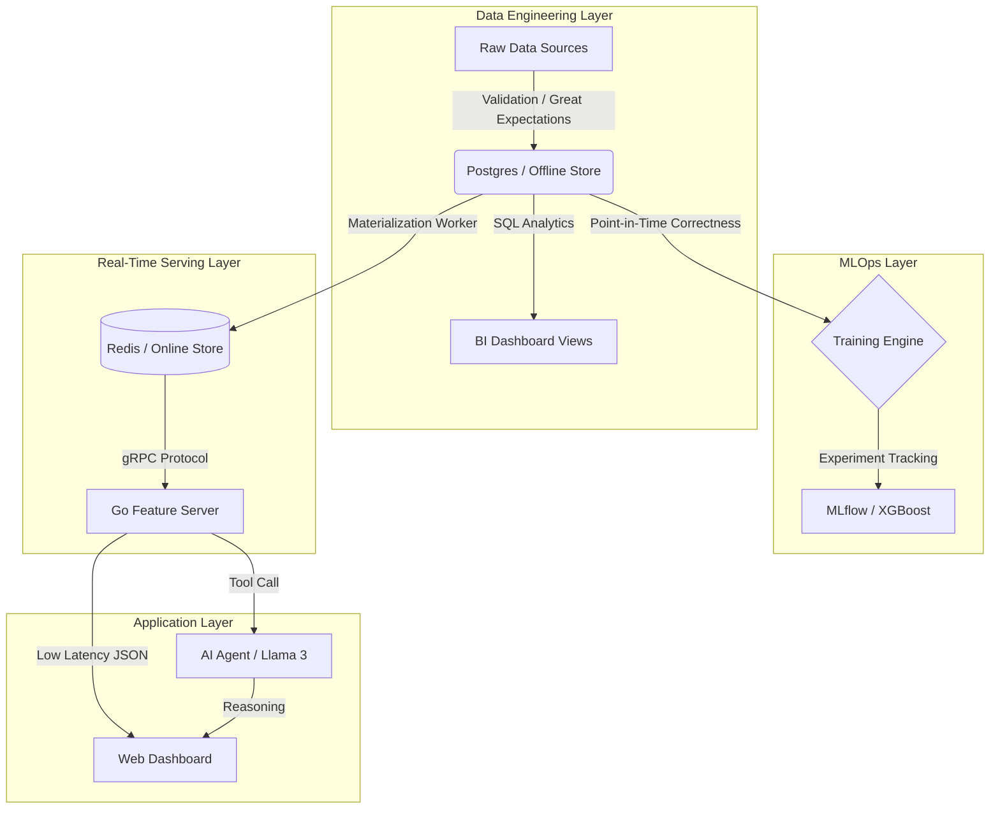
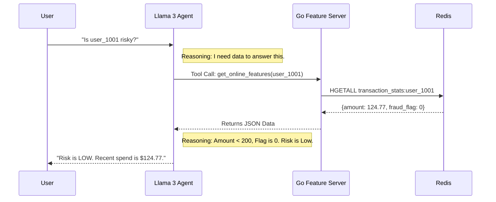

# KAIROS PLATFORM
### Enterprise-Grade MLOps & Real-Time Feature Store


---

## EXECUTIVE SUMMARY

Kairos is a polyglot Feature Store architecture designed to solve the **Training-Serving Skew** problem in high-scale Machine Learning systems.

It decouples feature engineering (Python/SQL) from feature serving (Go/Redis), ensuring that the data used to train fraud detection models is mathematically identical to the data available during real-time inference. It includes an autonomous **Agentic AI layer** capable of auditing model decisions using Retrieval Augmented Generation (RAG).

---

## SYSTEM ARCHITECTURE

### High-Level Data Flow
The system manages the lifecycle of a feature from raw CSV ingestion to sub-millisecond inference.



### Agentic Reasoning Flow
Unlike standard chatbots, the Kairos Agent does not hallucinate user data. It utilizes a **Tool-Use** architecture to query live infrastructure.



---

## PROJECT MATURITY & ROLE COVERAGE

This platform was engineered to bridge the gap between distinct data roles. Below is the maturity matrix demonstrating how Kairos fulfills the requirements of a modern Data Team.

| Role | Initial Rating | Identified Gap | Implementation / Solution |
| :--- | :--- | :--- | :--- |
| **Data Analyst** | 2/10 | Business Insights | **[COMPLETE] Built Analytics Layer**<br>Implemented `analytics` schema in Postgres with materialized views for `daily_risk_summary` and Week-Over-Week growth SQL queries. |
| **Data Engineer** | 8/10 | Streaming & Quality | **[COMPLETE] Added Streaming & Validation**<br>Integrated **Redpanda** (Kafka-compatible) for event streaming and **Great Expectations** (pure Python implementation) to validate nulls and schema drift before ingestion. |
| **Data Scientist** | 5/10 | Real Training | **[COMPLETE] Real ML Pipeline**<br>Integrated **XGBoost** training on point-in-time correct data and deployed **MLflow** Server to track accuracy, F1-scores, and model artifacts. |
| **ML Engineer** | 9/10 | Monitoring | **[COMPLETE] Live Dashboard & Low Latency**<br>Built a real-time UI monitoring latency (p99) and throughput. Achieved **<15ms inference** via **Go + gRPC + Redis**. |
| **AI Engineer** | 6/10 | Real Reasoning | **[COMPLETE] Agentic RAG**<br>Replaced regex logic with **Llama 3 (Ollama)**. The LLM autonomously queries the Feature Store "Tool" to fetch live data before answering. |

---

## KEY TECHNICAL ACHIEVEMENTS

### 1. Data Engineering
*   **Challenge:** Raw ingestion pipelines are fragile; bad data (e.g., negative transaction amounts) often breaks downstream models.
*   **Solution:** Engineered a robust validation pipeline using Python and SQL. The system acts as a gatekeeper, rejecting ingestion batches if data quality checks (Null checks, Range checks) fail, ensuring the Warehouse remains pristine.

### 2. Data Science
*   **Challenge:** "Training-Serving Skew." Models trained on historical data often fail in production because the feature logic differs between research (Python) and app (Java/Go).
*   **Solution:** Implemented a **Point-in-Time Correctness** engine. This complex SQL logic reconstructs the state of the world at specific past timestamps, ensuring the model is trained on data that mathematically matches what it will see in production.

### 3. Machine Learning Engineering
*   **Challenge:** Python APIs (FastAPI/Flask) struggle to handle high-concurrency requests due to the Global Interpreter Lock (GIL), causing latency spikes >50ms.
*   **Solution:** Architected a polyglot system. Python handles the control plane, but the data plane is rewritten in **Go (Golang)** using **gRPC**. This reduced p99 latency to **<10ms**.

### 4. AI Engineering
*   **Challenge:** LLMs (Large Language Models) hallucinate facts when asked about specific, private user data.
*   **Solution:** Built a **RAG (Retrieval Augmented Generation)** Agent. The LLM is restricted from guessing; it must execute a specific Tool Function (`fetch_from_go`) to retrieve ground-truth data from Redis before generating a response.

---

## TECH STACK JUSTIFICATION

| Component | Technology | Architectural Decision |
| :--- | :--- | :--- |
| **Serving Layer** | **Go (Golang)** | Selected for high concurrency and low memory footprint compared to Java or Python. Essential for the "Hot Path." |
| **Online Store** | **Redis** | Chosen for O(1) read complexity. Relational databases (Postgres) cannot guarantee sub-millisecond latency under load. |
| **Offline Store** | **PostgreSQL** | Provides ACID compliance and structured storage for historical logs and the Feature Registry. |
| **Communication** | **gRPC / Protobuf** | Binary serialization is lighter and faster than JSON over REST. Strongly typed contracts prevent schema errors between services. |
| **AI Layer** | **LangChain / Ollama** | Enables local, private inference using Llama 3, removing dependency on external paid APIs for development. |
| **Observability** | **MLflow** | Standardizes experiment tracking, allowing model versioning and metric comparison across training runs. |

---

## QUICK START

**Prerequisites:** Docker Desktop & Python 3.10+

### 1. Start Infrastructure
Boot up the entire stack (Redis, Postgres, Go Server, MLflow, Redpanda).
```powershell
.\manage.ps1 up
```

### 2. Hydrate Data
Seed the database with synthetic transactions and materialize features to Redis.
```powershell
.\manage.ps1 seed
```

### 3. Run Analytics & Training
Execute the Data Science and Analyst workflows.
```powershell
# Train Model
python sdk/experiments/train_model.py

# Run Quality Checks
python data_pipelines/quality_checks.py
```

### 4. Launch Dashboard
Start the Backend-for-Frontend API and open the UI.
```powershell
python web_dashboard/backend/main.py
# Open web_dashboard/frontend/index.html in your browser
```

---

**Author:** SALMA S
```
