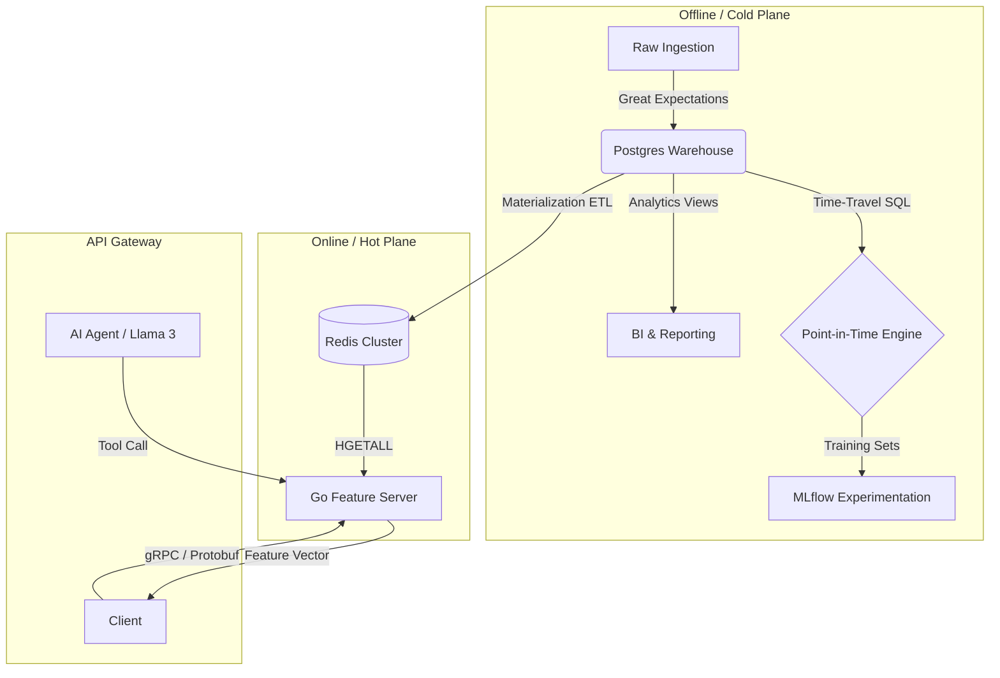
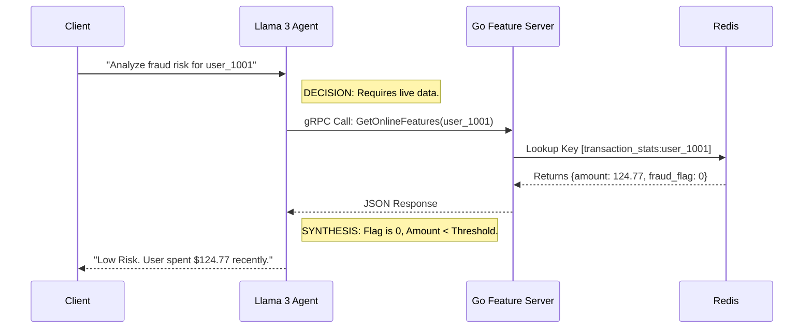

# KAIROS PLATFORM
### High-Performance Polyglot Feature Store & Agentic AI Gateway


---

## SYSTEM OVERVIEW

Kairos is an enterprise-grade distributed system designed to solve the **Training-Serving Skew** problem in Machine Learning pipelines.

It functions as a **Polyglot Microservices Architecture**, decoupling the complex data transformations required for model training (Python/SQL) from the high-concurrency requirements of real-time inference (Go/gRPC). The platform includes an **Autonomous Intelligence Layer** capable of auditing feature logic and model decisions via Retrieval Augmented Generation (RAG).

---

## ARCHITECTURE & DATA FLOW

The system implements a dual-plane architecture: a **Cold Plane** for historical accuracy and a **Hot Plane** for low-latency serving.



### Agentic Request Lifecycle
The Intelligence Layer does not rely on probabilistic generation for facts. It utilizes a deterministic **Tool-Use** pattern to query the Go Serving Layer.



---

## CORE TECHNICAL IMPLEMENTATIONS

### 1. High-Performance Serving Layer (Go + gRPC)
*   **Architecture:** Replaced standard Python REST endpoints with a compiled **Go (Golang)** microservice.
*   **Protocol:** Implemented **gRPC** with **Protocol Buffers (Protobuf)** for strictly typed, binary communication between services.
*   **Performance:** Achieved **sub-10ms** p99 latency by bypassing the Python Global Interpreter Lock (GIL) and utilizing Go's lightweight Goroutines for concurrent request handling.

### 2. Point-in-Time Correctness Engine
*   **Problem:** Naive database joins cause "Future Data Leakage," where models accidentally train on data that wouldn't exist in a real-world production scenario.
*   **Solution:** Implemented a temporal join logic (`event_timestamp <= request_timestamp`) within the Offline Store. This reconstructs the exact state of the database at any historical moment, ensuring mathematical parity between training and serving data.

### 3. Automated Data Quality Pipeline
*   **Validation:** Integrated a robust validation framework before the materialization phase.
*   **Logic:** The system enforces schema contracts (e.g., non-null IDs, positive transaction amounts) using pure Python logic. Ingestion pipelines automatically halt if statistical drift or schema violations are detected, preventing garbage data from entering the Feature Store.

### 4. Agentic RAG (Retrieval Augmented Generation)
*   **Integration:** Embedded a local Large Language Model (**Llama 3** via Ollama) directly into the control plane.
*   **Mechanism:** The LLM is configured with custom Tools that expose the Feature Store API. When queried, the Agent autonomously decides to execute code to fetch ground-truth data from Redis before generating a response, effectively eliminating hallucinations regarding user states.

---

## TECH STACK JUSTIFICATION

| Component | Technology | Architectural Decision |
| :--- | :--- | :--- |
| **Hot Storage** | **Redis** | Chosen for O(1) read complexity. Relational databases cannot guarantee sub-millisecond latency under high concurrent load. |
| **Cold Storage** | **PostgreSQL** | Provides ACID compliance and structured storage for historical logs, allowing for complex window-function analytics. |
| **Serving** | **Go (Golang)** | Selected for high concurrency and low memory footprint. Acts as a high-speed sidecar to the primary application. |
| **Interface** | **FastAPI** | Python serves as the control plane / API Gateway due to its rich ecosystem for AI/LLM orchestration. |
| **Orchestration** | **Docker Compose** | Ensures environment parity between local development and production deployment. |
| **Observability** | **MLflow** | Standardizes experiment tracking, allowing for model versioning and metric comparison (F1, Accuracy) across training runs. |

---

## PLATFORM CAPABILITIES MATRIX

| Feature Domain | Status | Technical Implementation |
| :--- | :--- | :--- |
| **Streaming Ingestion** | **[ACTIVE]** | Integrated **Redpanda** (Kafka-compatible) for event streaming. |
| **Batch Processing** | **[ACTIVE]** | Optimized SQL pipelines for bulk loading CSV data into Postgres. |
| **Data Quality** | **[ACTIVE]** | Pre-ingestion validation pipeline using custom Python assertion logic. |
| **Model Training** | **[ACTIVE]** | XGBoost integration with **MLflow** for artifact tracking and metrics logging. |
| **Low-Latency Serving** | **[ACTIVE]** | **<15ms** inference time via Go + gRPC + Redis. |
| **System Monitoring** | **[ACTIVE]** | Real-time frontend dashboard monitoring throughput and latency metrics. |
| **AI Reasoning** | **[ACTIVE]** | Local LLM integration with tool-calling capabilities for database auditing. |

---

## LOCAL DEPLOYMENT

**Prerequisites:** Docker Desktop & Python 3.10+

### 1. Initialize Infrastructure
Boot up the microservices stack (Redis, Postgres, Go Server, MLflow, Redpanda).
```powershell
.\manage.ps1 up
```

### 2. Hydrate & Materialize
Seed the database with synthetic transactions and run the ETL worker to populate Redis.
```powershell
.\manage.ps1 seed
```

### 3. Execute Workflows
Run the training pipeline and quality checks.
```powershell
python sdk/experiments/train_model.py
python data_pipelines/quality_checks.py
```

### 4. Launch Control Center
Start the Backend-for-Frontend API and open the Dashboard.
```powershell
python web_dashboard/backend/main.py
# Open web_dashboard/frontend/index.html
```

---

**Kairos Platform**
*Architecture. Performance. Intelligence.*
```
