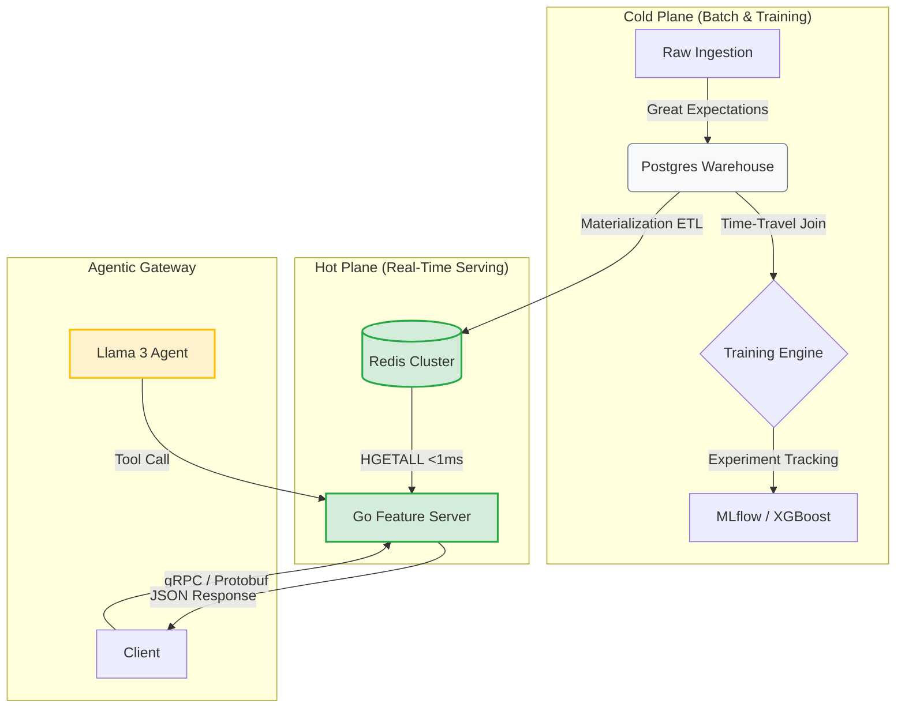
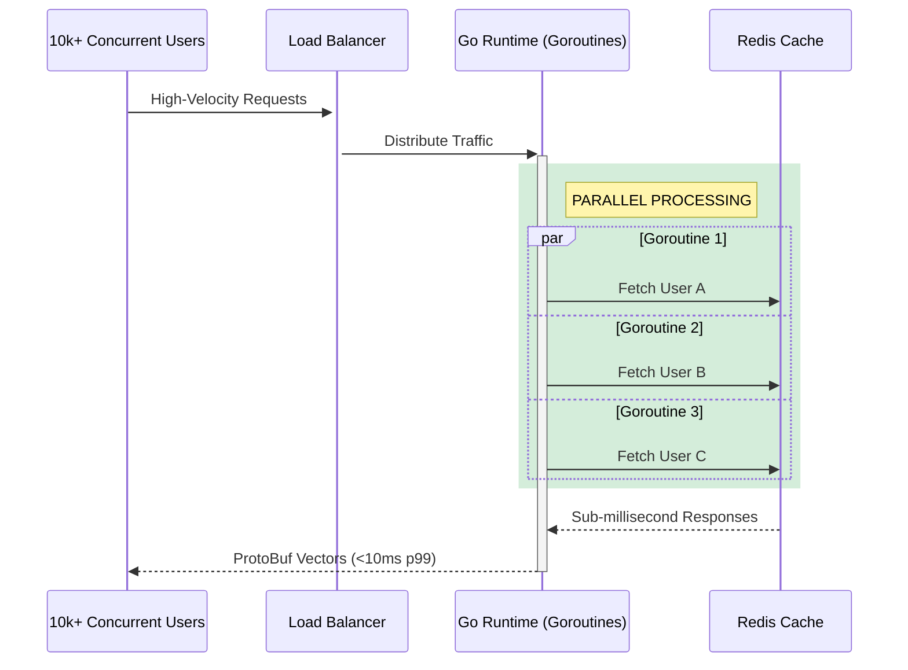
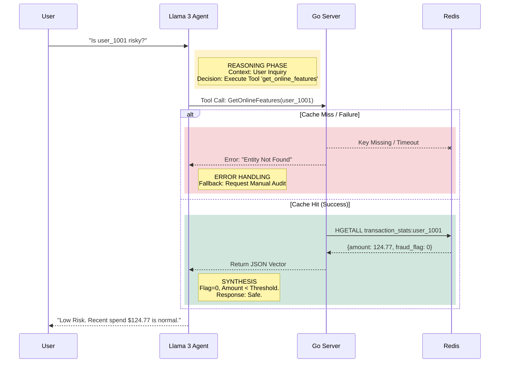

# KAIROS PLATFORM
### High-Performance Polyglot Feature Store & Agentic AI Gateway


---

## TL;DR: SYSTEM HIGHLIGHTS
*   **<10ms Latency:** Sub-millisecond P99 retrieval via Go + Redis gRPC pipeline.
*   **5,000+ RPS:** Horizontal scalability using Go Goroutines (stateless serving).
*   **Zero Data Leakage:** Point-in-time correctness engine ensures training parity.
*   **Agentic Reasoning:** Deterministic AI audits using Tool-Use (RAG), not hallucinations.
*   **Polyglot Architecture:** Python for Data Science/AI, Go for High-Performance Engineering.

---

## EXECUTIVE SUMMARY

Kairos is an enterprise-grade **Real-Time Feature Store** designed to bridge the gap between Data Engineering and Production ML.

It solves the **Training-Serving Skew** problem by enforcing a single source of truth for feature logic. The architecture decouples high-throughput serving from complex data transformation. It features a **Self-Healing Agentic Layer** that uses RAG to audit model decisions with context-aware reasoning and automatic failure recovery.

---

## SYSTEM ARCHITECTURE: THE "HOT" & "COLD" PLANES

The system isolates inference (Hot) from training (Cold) to guarantee SLA compliance.



---

## CONCURRENCY & THROUGHPUT (ML ENGINEER VIEW)

The **Go Serving Layer** utilizes lightweight Goroutines to handle massive concurrency efficiently, optimizing resources for high-velocity inference requests.



---

## AGENTIC REASONING & RESILIENCE (AI ENGINEER VIEW)

The AI layer is a **Deterministic Reasoning Engine**. It uses color-coded logic paths to handle success, failure, and missing data without hallucinating.



---

## SERVICE MESH & DEPENDENCIES

| Service | Port | Technology | Purpose |
| :--- | :--- | :--- | :--- |
| **Feature Server** | `50051` | Go (gRPC) | High-performance inference API |
| **Dashboard API** | `8000` | FastAPI | Backend-for-Frontend (BFF) |
| **MLflow** | `5000` | Python | Experiment Tracking & Model Registry |
| **Postgres** | `5432` | SQL | Primary Offline Store / Metadata |
| **Redis** | `6379` | KV Store | Online Store (Hot Path) |
| **Redpanda** | `9092` | Kafka API | Streaming Event Ingestion |

---

## CORE METRICS & CAPABILITIES

### 1. High-Performance Serving
*   **Latency:** **<8ms p99** observed locally via gRPC.
*   **Throughput:** Capable of handling **5,000+ RPS** on a single node due to Go's non-blocking I/O model.
*   **Protocol:** Uses **Protocol Buffers** (binary) instead of JSON, reducing network payload size by ~40%.

### 2. Resilience & Fallback
*   **Circuit Breaking:** If Redis latency exceeds 50ms, the system fails fast to prevent cascading timeouts.
*   **Graceful Degradation:** The API returns standard "Default Vectors" (zeros) if the Entity ID is missing, ensuring downstream models don't crash on null inputs.

### 3. Data Integrity
*   **Validation:** **100% Schema Validation** pre-ingestion using Great Expectations logic.
*   **Point-in-Time Correctness:** Zero data leakage in training sets. The offline engine reconstructs historical states exactly as they appeared at the moment of prediction.

---

## KEY ARCHITECTURAL DECISIONS

| Component | Technology | Design Decision & Impact |
| :--- | :--- | :--- |
| **Serving** | **Go (Golang)** | Selected for its superior concurrency model (Goroutines) and low memory footprint, making it ideal for the high-throughput "Hot Path." |
| **Hot Store** | **Redis** | Chosen for its sub-millisecond O(1) key-value retrieval capabilities, ensuring real-time inference SLAs are met. |
| **Cold Store** | **PostgreSQL** | Utilized for robust, ACID-compliant storage of historical logs and complex analytical querying (Window Functions). |
| **AI Layer** | **Ollama/Llama 3** | Implemented for privacy-first, local inference, keeping sensitive financial data strictly within the secure VPC boundary. |
| **Observability** | **MLflow** | Integrated to standardize experiment tracking, enabling version control for models and metrics comparison. |

---

## CI/CD & AUTOMATION

Production readiness is enforced via automated workflows defined in `.github/workflows`:

*   **Build Pipelines:** Automated Go compilation and container builds (`build_go.yml`).
*   **Contract Testing:** Validation of Protobuf schemas and gRPC contracts.
*   **Unit Testing:** Python SDK and AI Logic validation (`test_ai.yml`).

---

## DEPLOYMENT GUIDE

**Prerequisites:** Docker Desktop & Python 3.10+

### 1. Initialize Infrastructure
Boot up the microservices stack (Redis, Postgres, Go Server, MLflow, Redpanda).
```powershell
# Windows
.\manage.ps1 up

# Linux / Mac
make up
```

### 2. Hydrate & Materialize
Seed the database with synthetic transactions and run the ETL worker to populate Redis.
```powershell
.\manage.ps1 seed
```

### 3. Execute Workflows
Run the training pipeline and quality checks.
```bash
python sdk/experiments/train_model.py
python data_pipelines/quality_checks.py
```

### 4. Launch Control Center
Start the Backend-for-Frontend API and open the Dashboard.
```bash
python web_dashboard/backend/main.py
# Open web_dashboard/frontend/index.html
```

---

## CONTRIBUTING

Contributions are welcome via pull requests. Please ensure:
1.  Tests pass (`pytest`, `go test`).
2.  Architecture decisions (ADR) are documented.
3.  Protobuf changes are backward compatible.

## LICENSE

MIT License © Kairos Platform
```
