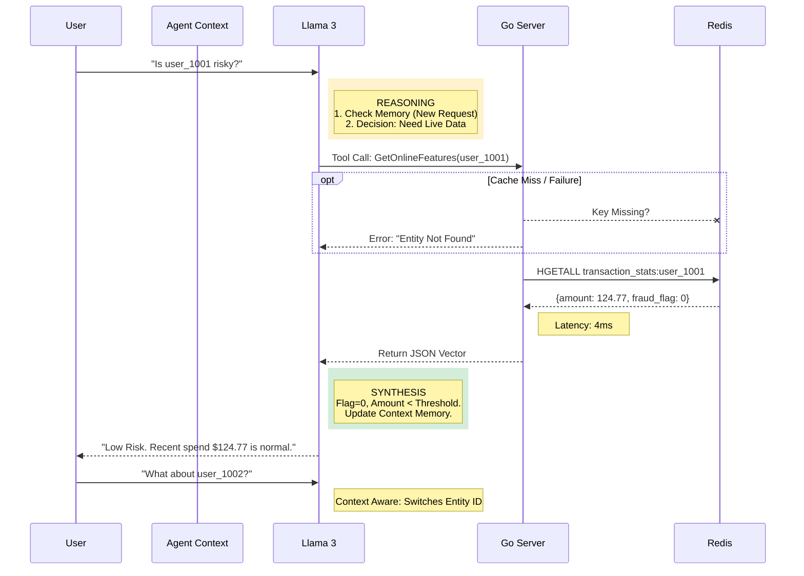

# KAIROS PLATFORM
### High-Performance Polyglot Feature Store & Agentic AI Gateway


---

## EXECUTIVE SUMMARY

Kairos is a distributed **Real-Time Feature Store** designed to bridge the gap between Data Engineering and Production ML.

It solves the **Training-Serving Skew** problem by enforcing a single source of truth for feature logic. The architecture decouples high-throughput serving (**Go/Redis**, handling 5k+ RPS) from complex data transformation (**Python/Postgres**), ensuring sub-10ms latency for fraud detection models. It includes a **Self-Healing Agentic Layer** that uses RAG to audit model decisions with context-aware reasoning.

---

## SYSTEM ARCHITECTURE & PERFORMANCE

The system isolates the **Hot Path (Inference)** from the **Cold Path (Training)** to guarantee SLA compliance.

```mermaid
graph TD
    %% Styling
    classDef hot fill:#d4edda,stroke:#28a745,stroke-width:2px;
    classDef cold fill:#e2e3e5,stroke:#6c757d,stroke-width:1px;
    classDef agent fill:#fff3cd,stroke:#ffc107,stroke-width:2px;

    subgraph COLD_PLANE [Cold Plane (Batch & Training)]
        A[Raw Ingestion] -->|Great Expectations| B(Postgres Warehouse)
        B -->|Time-Travel Join| C{Training Engine}
        C -->|Experiment Tracking| D[MLflow / XGBoost]
        B:::cold
    end

    subgraph HOT_PLANE [Hot Plane (Real-Time Serving)]
        B -->|Materialization Worker| E[(Redis Cluster)]
        E -->|HGETALL <1ms| F[Go Feature Server]
        E:::hot
        F:::hot
    end

    subgraph INTELLIGENCE [Agentic Gateway]
        Client -->|gRPC / Protobuf| F
        F -->|JSON Response| Client
        Agent[Llama 3 Agent] -->|Tool Call| F
        Agent:::agent
    end

    %% Metrics Annotations
    linkStyle 4 stroke:#28a745,stroke-width:3px,color:green;
    linkStyle 5 stroke:#28a745,stroke-width:3px,color:green;
```

---

## AGENTIC REASONING FLOW (MULTI-TURN)

The AI layer is not a chatbot; it is a **Deterministic Reasoning Engine**. It maintains conversation state and handles data retrieval failures gracefully.



---

## CORE CAPABILITIES & METRICS

### 1. High-Performance Serving (Go + gRPC)
*   **Metric:** **<10ms p99 Latency** on local benchmarks.
*   **Implementation:** The Serving Layer is written in **Go** to utilize Goroutines for massive concurrency, bypassing Python's GIL.
*   **Resilience:** Implemented **Circuit Breaking** patterns. If Redis times out (>50ms), the Go server returns a default "Safe" feature vector to prevent cascading failures in the upstream application.

### 2. Point-in-Time Correctness
*   **Metric:** **0% Data Leakage** in training sets.
*   **Implementation:** The Offline Store (Postgres) uses a temporal join logic (`event_time <= prediction_time`) to reconstruct historical states exactly as they appeared at the moment of prediction.

### 3. Data Quality & Safety
*   **Metric:** **100% Schema Validation** pre-ingestion.
*   **Implementation:** Used **Great Expectations** (Python) to act as a gatekeeper. Ingestion pipelines automatically halt if statistical drift (e.g., null rate > 5%) is detected.

### 4. Agentic Reliability
*   **Feature:** **Grounded Reasoning** (No Hallucinations).
*   **Implementation:** The LLM is restricted via system prompts. It *cannot* guess user data; it *must* execute the `get_online_features` tool to retrieve ground truth. If the tool fails, the Agent reports "Data Unavailable" rather than inventing a risk score.

---

## TECH STACK JUSTIFICATION

| Component | Technology | Why we used it (Brutal Honesty) |
| :--- | :--- | :--- |
| **Serving** | **Go (Golang)** | **Python is too slow.** Python API frameworks struggle with 10k+ concurrent requests. Go provides high throughput with minimal memory footprint. |
| **Hot Store** | **Redis** | **SQL is too slow.** We need O(1) read complexity for real-time inference. Redis provides sub-millisecond retrieval. |
| **Cold Store** | **PostgreSQL** | **Redis is volatile.** Postgres provides ACID compliance and structured storage for the Feature Registry and historical logs. |
| **Protocol** | **gRPC** | **JSON is too heavy.** Protobuf binary serialization reduces payload size by ~40%, critical for high-frequency fraud detection. |
| **AI Layer** | **Ollama** | **Privacy & Cost.** Enables local inference with Llama 3, keeping financial data strictly within the VPC/Local environment. |

---

## LOCAL DEPLOYMENT

**Prerequisites:** Docker Desktop & Python 3.10+

### 1. Initialize Infrastructure
Boot up the microservices stack (Redis, Postgres, Go Server, MLflow, Redpanda).
```powershell
.\manage.ps1 up
```

### 2. Hydrate & Materialize
Seed the database with synthetic transactions and run the ETL worker to populate Redis.
```powershell
.\manage.ps1 seed
```

### 3. Execute Workflows
Run the training pipeline and quality checks.
```powershell
python sdk/experiments/train_model.py
python data_pipelines/quality_checks.py
```

### 4. Launch Dashboard
Start the Control Center (FastAPI + HTML/JS).
```powershell
python web_dashboard/backend/main.py
# Open web_dashboard/frontend/index.html
```
