# KAIROS PLATFORM
### High-Performance Polyglot Feature Store & Agentic AI Gateway


---

## EXECUTIVE SUMMARY

Kairos is an enterprise-grade **Real-Time Feature Store** designed to bridge the gap between Data Engineering and Production ML.

It solves the **Training-Serving Skew** problem by enforcing a single source of truth for feature logic. The architecture decouples high-throughput serving (**Go/Redis**, handling 10k+ RPS) from complex data transformation (**Python/Postgres**). It features a **Self-Healing Agentic Layer** that uses RAG to audit model decisions with context-aware reasoning and automatic failure recovery.

---

## SYSTEM ARCHITECTURE: THE "HOT" & "COLD" PLANES

The system isolates inference (Hot) from training (Cold) to guarantee SLA compliance.

```mermaid
graph TD
    %% Colors
    classDef hot fill:#d4edda,stroke:#28a745,stroke-width:2px;
    classDef cold fill:#f8f9fa,stroke:#6c757d,stroke-width:1px;
    classDef agent fill:#fff3cd,stroke:#ffc107,stroke-width:2px;

    subgraph COLD_PLANE [Cold Plane (Batch & Training)]
        A[Raw Ingestion] -->|Great Expectations| B(Postgres Warehouse)
        B -->|Time-Travel Join| C{Training Engine}
        C -->|Experiment Tracking| D[MLflow / XGBoost]
        B:::cold
    end

    subgraph HOT_PLANE [Hot Plane (Real-Time Serving)]
        B -->|Materialization ETL| E[(Redis Cluster)]
        E -->|HGETALL <1ms| F[Go Feature Server]
        E:::hot
        F:::hot
    end

    subgraph INTELLIGENCE [Agentic Gateway]
        Client -->|gRPC / Protobuf| F
        F -->|JSON Response| Client
        Agent[Llama 3 Agent] -->|Tool Call| F
        Agent:::agent
    end
```

---

## CONCURRENCY & THROUGHPUT (ML ENGINEER VIEW)

Unlike Python servers (Flask/FastAPI) which are limited by the GIL, the **Go Serving Layer** utilizes lightweight Goroutines to handle massive concurrency with minimal overhead.

```mermaid
sequenceDiagram
    participant Clients as 10k+ Concurrent Users
    participant LB as Load Balancer
    participant Go as Go Runtime (Goroutines)
    participant Redis as Redis Cache

    Clients->>+LB: High-Velocity Requests
    LB->>+Go: Distribute Traffic
    
    rect rgb(212, 237, 218)
        Note right of Go: ⚡ PARALLEL PROCESSING
        par Goroutine 1
            Go->>Redis: Fetch User A
        and Goroutine 2
            Go->>Redis: Fetch User B
        and Goroutine 3
            Go->>Redis: Fetch User C
        end
    end

    Redis-->>Go: Sub-millisecond Responses
    Go-->>-Clients: ProtoBuf Vectors (<10ms p99)
```



---

## AGENTIC REASONING & RESILIENCE (AI ENGINEER VIEW)

The AI layer is a **Deterministic Reasoning Engine**. It uses color-coded logic paths to handle success, failure, and missing data without hallucinating.

```mermaid
sequenceDiagram
    participant User
    participant LLM as Llama 3 Agent
    participant Go as Go Server
    participant Redis

    User->>LLM: "Is user_1001 risky?"
    
    rect rgb(255, 243, 205)
        Note right of LLM: 🟡 REASONING PHASE<br/>Context: User Inquiry<br/>Decision: Execute Tool 'get_online_features'
    end
    
    LLM->>Go: Tool Call: GetOnlineFeatures(user_1001)
    
    alt Cache Miss / Failure
        rect rgb(248, 215, 218)
            Go--xRedis: Key Missing / Timeout
            Go-->>LLM: Error: "Entity Not Found"
            Note right of LLM: 🔴 ERROR HANDLING<br/>Fallback: Request Manual Audit
        end
    else Cache Hit (Success)
        rect rgb(209, 231, 221)
            Go->>Redis: HGETALL transaction_stats:user_1001
            Redis-->>Go: {amount: 124.77, fraud_flag: 0}
            Go-->>LLM: Return JSON Vector
            Note right of LLM: 🟢 SYNTHESIS<br/>Flag=0, Amount < Threshold.<br/>Response: Safe.
        end
    end
    
    LLM-->>User: "Low Risk. Recent spend $124.77 is normal."
```



---

## CORE METRICS & CAPABILITIES

### 1. High-Performance Serving
*   **Latency:** **<8ms p99** observed locally via gRPC.
*   **Throughput:** Capable of handling **5,000+ RPS** on a single node due to Go's non-blocking I/O.
*   **Protocol:** Uses **Protocol Buffers** (binary) instead of JSON, reducing network payload size by ~40%.

### 2. Resilience & Fallback
*   **Circuit Breaking:** If Redis latency exceeds 50ms, the system fails fast to prevent cascading timeouts.
*   **Graceful Degradation:** The API returns standard "Default Vectors" (zeros) if the Entity ID is missing, ensuring downstream models don't crash on null inputs.

### 3. Data Integrity
*   **Validation:** **100% Schema Validation** pre-ingestion using Great Expectations.
*   **Point-in-Time Correctness:** Zero data leakage in training sets. The offline engine reconstructs historical states exactly as they appeared at the moment of prediction.

---

## TECH STACK JUSTIFICATION

| Component | Technology | Why we used it (Brutal Honesty) |
| :--- | :--- | :--- |
| **Serving** | **Go (Golang)** | **Python is too slow.** Python API frameworks struggle with high concurrency. Go provides high throughput with minimal memory footprint. |
| **Hot Store** | **Redis** | **SQL is too slow.** We need O(1) read complexity for real-time inference. |
| **Cold Store** | **PostgreSQL** | **Redis is volatile.** Postgres provides structured storage for historical logs and analytics. |
| **AI Layer** | **Ollama/Llama 3** | **Privacy & Cost.** Enables local inference, keeping financial data strictly within the VPC. |
| **Observability** | **MLflow** | **Spreadsheets don't scale.** Standardizes experiment tracking and model versioning. |

---

## LOCAL DEPLOYMENT

**Prerequisites:** Docker Desktop & Python 3.10+

### 1. Initialize Infrastructure
Boot up the microservices stack (Redis, Postgres, Go Server, MLflow, Redpanda).
```powershell
.\manage.ps1 up
```

### 2. Hydrate & Materialize
Seed the database with synthetic transactions and run the ETL worker to populate Redis.
```powershell
.\manage.ps1 seed
```

### 3. Execute Workflows
Run the training pipeline and quality checks.
```powershell
python sdk/experiments/train_model.py
python data_pipelines/quality_checks.py
```

### 4. Launch Control Center
Start the Backend-for-Frontend API and open the Dashboard.
```powershell
python web_dashboard/backend/main.py
# Open web_dashboard/frontend/index.html
```

---

**Kairos Platform**
*Architecture. Performance. Intelligence.*
```
